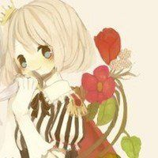

# List

The `mu-list` list displays multiple lines of entries in a vertical arrangment as a single contiguous element.

## Example

The `mu-list` needs to be used with `mu-list-item` to compose various parts of the list item by different components. There is an example with only icons and titles below.

:::demo
```html
<mu-paper :z-depth="1" class="demo-list-wrap">
  <mu-appbar color="teal">
    <mu-button icon slot="left">
      <mu-icon value="menu"></mu-icon>
    </mu-button>
    Menus
  </mu-appbar>
  <mu-list>
    <mu-list-item button :ripple="false">
      <mu-list-item-action>
        <mu-icon value="inbox"></mu-icon>
      </mu-list-item-action>
      <mu-list-item-title>Inbox</mu-list-item-title>
    </mu-list-item>
    <mu-list-item button :ripple="false">
      <mu-list-item-action>
        <mu-icon value="grade"></mu-icon>
      </mu-list-item-action>
      <mu-list-item-title>Stared</mu-list-item-title>
    </mu-list-item>
    <mu-list-item button :ripple="false">
      <mu-list-item-action>
        <mu-icon value="send"></mu-icon>
      </mu-list-item-action>
      <mu-list-item-title>Sent mail</mu-list-item-title>
    </mu-list-item>
    <mu-list-item button :ripple="false">
      <mu-list-item-action>
        <mu-icon value="drafts"></mu-icon>
      </mu-list-item-action>
      <mu-list-item-title>Drafts</mu-list-item-title>
    </mu-list-item>
  </mu-list>
  <mu-divider></mu-divider>
  <mu-list>
    <mu-list-item button :ripple="false">
      <mu-list-item-title>All mail</mu-list-item-title>
      <mu-list-item-action>
        <mu-icon value="info"></mu-icon>
      </mu-list-item-action>
    </mu-list-item>
    <mu-list-item button :ripple="false">
      <mu-list-item-title>Trash</mu-list-item-title>
      <mu-list-item-action>
        <mu-icon value="info"></mu-icon>
      </mu-list-item-action>
    </mu-list-item>
    <mu-list-item button :ripple="false">
      <mu-list-item-title>Spam</mu-list-item-title>
      <mu-list-item-action>
        <mu-icon value="info"></mu-icon>
      </mu-list-item-action>
    </mu-list-item>
    <mu-list-item button :ripple="false">
      <mu-list-item-title>Follow up</mu-list-item-title>
      <mu-list-item-action>
        <mu-icon value="info"></mu-icon>
      </mu-list-item-action>
    </mu-list-item>
  </mu-list>
</mu-paper>
<style>
.demo-list-wrap {
  width: 100%;
  max-width: 360px;
}
</style>
```
:::

## Avatar and Icon list

When the `mu-list-item` content contains the `mu-avatar` component, the `avatar` parameter needs to be set in the `mu-list-item` and `mu-list-item-action` components.

:::demo
```html
<mu-paper :z-depth="1" class="demo-list-wrap">
  <mu-appbar color="lightBlue400">
    <mu-button icon slot="left">
      <mu-icon value="menu"></mu-icon>
    </mu-button>
    Contacts
    <mu-button icon slot="right">
      <mu-icon value="search"></mu-icon>
    </mu-button>
  </mu-appbar>
  <mu-list>
    <mu-sub-header>Today</mu-sub-header>
    <mu-list-item avatar button :ripple="false">
      <mu-list-item-action>
        <mu-avatar>
          
        </mu-avatar>
      </mu-list-item-action>
      <mu-list-item-title>Mike Li</mu-list-item-title>
      <mu-list-item-action>
        <mu-icon value="chat_bubble"></mu-icon>
      </mu-list-item-action>
    </mu-list-item>
    <mu-list-item avatar button :ripple="false">
      <mu-list-item-action>
        <mu-avatar>
          
        </mu-avatar>
      </mu-list-item-action>
      <mu-list-item-title>Maco Mai</mu-list-item-title>
      <mu-list-item-action>
        <mu-icon value="chat_bubble"></mu-icon>
      </mu-list-item-action>
    </mu-list-item>
    <mu-list-item avatar button :ripple="false">
      <mu-list-item-action>
        <mu-avatar>
          
        </mu-avatar>
      </mu-list-item-action>
      <mu-list-item-title>Alex Qin</mu-list-item-title>
      <mu-list-item-action>
        <mu-icon value="chat_bubble"></mu-icon>
      </mu-list-item-action>
    </mu-list-item>
    <mu-list-item avatar button :ripple="false">
      <mu-list-item-action>
        <mu-avatar>
          
        </mu-avatar>
      </mu-list-item-action>
      <mu-list-item-title>Allen Qun</mu-list-item-title>
      <mu-list-item-action>
        <mu-icon value="chat_bubble"></mu-icon>
      </mu-list-item-action>
    </mu-list-item>
    <mu-list-item avatar button :ripple="false">
      <mu-list-item-action>
        <mu-avatar>
          
        </mu-avatar>
      </mu-list-item-action>
      <mu-list-item-title>Myron Liu</mu-list-item-title>
      <mu-list-item-action>
        <mu-icon value="chat_bubble"></mu-icon>
      </mu-list-item-action>
    </mu-list-item>
  </mu-list>
  <mu-divider></mu-divider>
  <mu-list>
    <mu-sub-header>History</mu-sub-header>
    <mu-list-item avatar button :ripple="false">
      <mu-list-item-action>
        <mu-avatar>
          
        </mu-avatar>
      </mu-list-item-action>
      <mu-list-item-title>Gaia Zhou</mu-list-item-title>
      <mu-list-item-action>
        <mu-icon value="chat_bubble"></mu-icon>
      </mu-list-item-action>
    </mu-list-item>
    <mu-list-item avatar button :ripple="false">
      <mu-list-item-action>
        <mu-avatar>
          
        </mu-avatar>
      </mu-list-item-action>
      <mu-list-item-title>Miller Wang</mu-list-item-title>
      <mu-list-item-action>
        <mu-icon value="chat_bubble"></mu-icon>
      </mu-list-item-action>
    </mu-list-item>
  </mu-list>
</mu-paper>
<style>
.demo-list-wrap {
  width: 100%;
  max-width: 360px;
}
</style>
```
:::

## Contact list

:::demo
```html
<mu-paper :z-depth="1" class="demo-list-wrap">
  <mu-appbar color="secondary">
    <mu-button icon slot="left">
      <mu-icon value="menu"></mu-icon>
    </mu-button>
    Contacts
    <mu-button icon slot="right">
      <mu-icon value="search"></mu-icon>
    </mu-button>
  </mu-appbar>
  <mu-list>
    <mu-list-item avatar button :ripple="false">
      <mu-list-item-action>
        <mu-icon value="star" color="pink"></mu-icon>
      </mu-list-item-action>
      <mu-list-item-title>Mike Li</mu-list-item-title>
      <mu-list-item-action>
        <mu-avatar>
          
        </mu-avatar>
      </mu-list-item-action>
    </mu-list-item>
    <mu-list-item avatar button :ripple="false">
      <mu-list-item-action></mu-list-item-action>
      <mu-list-item-title>Maco Mai</mu-list-item-title>
      <mu-list-item-action>
        <mu-avatar>
          
        </mu-avatar>
      </mu-list-item-action>
    </mu-list-item>
    <mu-list-item avatar button :ripple="false">
      <mu-list-item-action></mu-list-item-action>
      <mu-list-item-title>Alex Qin</mu-list-item-title>
      <mu-list-item-action>
        <mu-avatar>
          
        </mu-avatar>
      </mu-list-item-action>
    </mu-list-item>
    <mu-list-item avatar button :ripple="false">
      <mu-list-item-action></mu-list-item-action>
      <mu-list-item-title>Allen Qun</mu-list-item-title>
      <mu-list-item-action>
        <mu-avatar>
          
        </mu-avatar>
      </mu-list-item-action>
    </mu-list-item>
  </mu-list>
</mu-paper>
<style>
.demo-list-wrap {
  width: 100%;
  max-width: 360px;
}
</style>
```
:::

## Two lines of content and subtitle

The `textline` parameter is used to change the height of the list item, with `two-line` and `three-line` optional.

:::demo
```html
<mu-paper :z-depth="1" class="demo-list-wrap">
  <mu-appbar color="lightBlue">
    <mu-button icon slot="left">
      <mu-icon value="menu"></mu-icon>
    </mu-button>
    Files
    <mu-button icon slot="right">
      <mu-icon value="view_quilt"></mu-icon>
    </mu-button>
  </mu-appbar>
  <mu-list textline="two-line">
    <mu-sub-header inset>Folders</mu-sub-header>
    <mu-list-item avatar button :ripple="false">
      <mu-list-item-action>
        <mu-avatar>
          <mu-icon value="folder"></mu-icon>
        </mu-avatar>
      </mu-list-item-action>
      <mu-list-item-content>
        <mu-list-item-title>Photos</mu-list-item-title>
        <mu-list-item-sub-title>Jan 9, 2014</mu-list-item-sub-title>
      </mu-list-item-content>
      <mu-list-item-action>
        <mu-button icon>
          <mu-icon value="info"></mu-icon>
        </mu-button>
      </mu-list-item-action>
    </mu-list-item>
    <mu-list-item avatar button :ripple="false">
      <mu-list-item-action>
        <mu-avatar>
          <mu-icon value="folder"></mu-icon>
        </mu-avatar>
      </mu-list-item-action>
      <mu-list-item-content>
        <mu-list-item-title>Recipes</mu-list-item-title>
        <mu-list-item-sub-title>Jan 17, 2014</mu-list-item-sub-title>
      </mu-list-item-content>
      <mu-list-item-action>
        <mu-button icon>
          <mu-icon value="info"></mu-icon>
        </mu-button>
      </mu-list-item-action>
    </mu-list-item>
    <mu-list-item avatar button :ripple="false">
      <mu-list-item-action>
        <mu-avatar>
          <mu-icon value="folder"></mu-icon>
        </mu-avatar>
      </mu-list-item-action>
      <mu-list-item-content>
        <mu-list-item-title>Work</mu-list-item-title>
        <mu-list-item-sub-title>Jan 28, 2014</mu-list-item-sub-title>
      </mu-list-item-content>
      <mu-list-item-action>
        <mu-button icon>
          <mu-icon value="info"></mu-icon>
        </mu-button>
      </mu-list-item-action>
    </mu-list-item>
  </mu-list>
  <mu-divider inset></mu-divider>
  <mu-list textline="two-line">
    <mu-sub-header inset>Files</mu-sub-header>
    <mu-list-item avatar button :ripple="false">
      <mu-list-item-action>
        <mu-avatar color="blue">
          <mu-icon value="assignment"></mu-icon>
        </mu-avatar>
      </mu-list-item-action>
      <mu-list-item-content>
        <mu-list-item-title>Vacation itinerary</mu-list-item-title>
        <mu-list-item-sub-title>Jan 20, 2014</mu-list-item-sub-title>
      </mu-list-item-content>
      <mu-list-item-action>
        <mu-button icon>
          <mu-icon value="info"></mu-icon>
        </mu-button>
      </mu-list-item-action>
    </mu-list-item>
    <mu-list-item avatar button :ripple="false">
      <mu-list-item-action>
        <mu-avatar color="yellow600">
          <mu-icon value="insert_chart"></mu-icon>
        </mu-avatar>
      </mu-list-item-action>
      <mu-list-item-content>
        <mu-list-item-title>Kitchen remodel</mu-list-item-title>
        <mu-list-item-sub-title>Jan 10, 2014</mu-list-item-sub-title>
      </mu-list-item-content>
      <mu-list-item-action>
        <mu-button icon>
          <mu-icon value="info"></mu-icon>
        </mu-button>
      </mu-list-item-action>
    </mu-list-item>
  </mu-list>
</mu-paper>
<style>
.demo-list-wrap {
  width: 100%;
  max-width: 360px;
  overflow: hidden;
}
</style>
```
:::

## Three lines of content

:::demo
```html
<mu-paper :z-depth="1" class="demo-list-wrap">
  <mu-appbar color="cyan">
    <mu-button icon slot="left">
      <mu-icon value="menu"></mu-icon>
    </mu-button>
    Inbox
    <mu-button icon slot="right">
      <mu-icon value="search"></mu-icon>
    </mu-button>
  </mu-appbar>
  <mu-list textline="three-line">
    <mu-sub-header>今天</mu-sub-header>
    <mu-list-item avatar :ripple="false" button>
      <mu-list-item-action>
        <mu-avatar>
          
        </mu-avatar>
      </mu-list-item-action>
      <mu-list-item-content>
        <mu-list-item-title>这个周末一起吃饭么?</mu-list-item-title>
        <mu-list-item-sub-title>
          <span style="color: rgba(0, 0, 0, .87)">Myron Liu -</span> 周末要来你这里出差，要不要一起吃个饭呀，实在编不下去了,哈哈哈哈哈哈
        </mu-list-item-sub-title>
      </mu-list-item-content>
    </mu-list-item>
    <mu-divider></mu-divider>
    <mu-list-item avatar :ripple="false" button>
      <mu-list-item-action>
        <mu-avatar>
          
        </mu-avatar>
      </mu-list-item-action>
      <mu-list-item-content>
        <mu-list-item-title>Alex Qin</mu-list-item-title>
        <mu-list-item-sub-title>
          <span style="color: rgba(0, 0, 0, .87)">看电影啊</span><br/>
          我们去看电影，最近有部烂片上映，又有吐槽的了
        </mu-list-item-sub-title>
      </mu-list-item-content>
    </mu-list-item>
    <mu-divider></mu-divider>
    <mu-list-item avatar :ripple="false" button>
      <mu-list-item-action>
        <mu-avatar>
          
        </mu-avatar>
      </mu-list-item-action>
      <mu-list-item-content>
        <mu-list-item-title>LOL</mu-list-item-title>
        <mu-list-item-sub-title>
          <span style="color: rgba(0, 0, 0, .87)">去打游戏啊</span><br/>
          周末一起 LOL
        </mu-list-item-sub-title>
      </mu-list-item-content>
    </mu-list-item>
    <mu-divider></mu-divider>
    <mu-list-item avatar :ripple="false" button>
      <mu-list-item-action>
        <mu-avatar>
          
        </mu-avatar>
      </mu-list-item-action>
      <mu-list-item-content>
        <mu-list-item-title>LOL</mu-list-item-title>
        <mu-list-item-sub-title>
          <span style="color: rgba(0, 0, 0, .87)">哇去</span><br/>
          实在编不下去，这就是个demo
        </mu-list-item-sub-title>
      </mu-list-item-content>
    </mu-list-item>
  </mu-list>
</mu-paper>
<style>
.demo-list-wrap {
  width: 100%;
  max-width: 360px;
  overflow: hidden;
}
</style>
```
:::

## Post text and chart

:::demo
```html
<mu-paper :z-depth="1" class="demo-list-wrap">
  <mu-appbar color="pink">
    <mu-button icon slot="left">
      <mu-icon value="menu"></mu-icon>
    </mu-button>
    Inbox
    <mu-button icon slot="right">
      <mu-icon value="search"></mu-icon>
    </mu-button>
  </mu-appbar>
  <mu-list textline="two-line">
    <mu-list-item avatar :ripple="false" button>
      <mu-list-item-content>
        <mu-list-item-title>Ali Connors</mu-list-item-title>
        <mu-list-item-sub-title style="color: rgba(0, 0, 0, .87)">Brunch this weekend?</mu-list-item-sub-title>
        <mu-list-item-sub-title>
          I'll be in your neighborhood doing errands this weekend. Do you want to hang out?
        </mu-list-item-sub-title>
      </mu-list-item-content>
      <mu-list-item-action >
        <mu-list-item-after-text>15 min</mu-list-item-after-text>
        <mu-checkbox color="yellow700" v-model="selects" value="value1" uncheck-icon="star_border" checked-icon="star"></mu-checkbox>
      </mu-list-item-action>
    </mu-list-item>
    <mu-divider></mu-divider>
    <mu-list-item avatar :ripple="false" button>
      <mu-list-item-content>
        <mu-list-item-title>me, Scrott, Jennifer</mu-list-item-title>
        <mu-list-item-sub-title style="color: rgba(0, 0, 0, .87)">Summer BBQ</mu-list-item-sub-title>
        <mu-list-item-sub-title>
          Wish I could come, but I'm out of town this weekend.
        </mu-list-item-sub-title>
      </mu-list-item-content>
      <mu-list-item-action >
        <mu-list-item-after-text>2 hr</mu-list-item-after-text>
        <mu-checkbox color="yellow700" v-model="selects" value="value2"  uncheck-icon="star_border" checked-icon="star"></mu-checkbox>
      </mu-list-item-action>
    </mu-list-item>
    <mu-divider></mu-divider>
     <mu-list-item avatar :ripple="false" button>
      <mu-list-item-content>
        <mu-list-item-title>Sandra Adams</mu-list-item-title>
        <mu-list-item-sub-title style="color: rgba(0, 0, 0, .87)">Oui oui</mu-list-item-sub-title>
        <mu-list-item-sub-title>
          Do you have Paris recommendations? Have you ever been?
        </mu-list-item-sub-title>
      </mu-list-item-content>
      <mu-list-item-action >
        <mu-list-item-after-text>6 hr</mu-list-item-after-text>
        <mu-checkbox color="yellow700" v-model="selects" value="value3"  uncheck-icon="star_border" checked-icon="star"></mu-checkbox>
      </mu-list-item-action>
    </mu-list-item>
    <mu-divider></mu-divider>
     <mu-list-item avatar :ripple="false" button>
      <mu-list-item-content>
        <mu-list-item-title>Trevor Hansen</mu-list-item-title>
        <mu-list-item-sub-title style="color: rgba(0, 0, 0, .87)">Birthday gift</mu-list-item-sub-title>
        <mu-list-item-sub-title>
          Have any ideas about what we should get Heidi for her
        </mu-list-item-sub-title>
      </mu-list-item-content>
      <mu-list-item-action>
        <mu-list-item-after-text>12 hr</mu-list-item-after-text>
        <mu-checkbox color="yellow700" v-model="selects" value="value4"  uncheck-icon="star_border" checked-icon="star"></mu-checkbox>
      </mu-list-item-action>
    </mu-list-item>
    <mu-divider></mu-divider>
     <mu-list-item avatar :ripple="false" button>
      <mu-list-item-content>
        <mu-list-item-title>Britta Holt</mu-list-item-title>
        <mu-list-item-sub-title style="color: rgba(0, 0, 0, .87)">Recipe to try</mu-list-item-sub-title>
        <mu-list-item-sub-title>
          We should eat this: Grate, Squash, Corn, and tomatillo Tacos.
        </mu-list-item-sub-title>
      </mu-list-item-content>
      <mu-list-item-action >
        <mu-list-item-after-text>18hr</mu-list-item-after-text>
        <mu-checkbox color="yellow700" v-model="selects" value="value5"  uncheck-icon="star_border" checked-icon="star"></mu-checkbox>
      </mu-list-item-action>
    </mu-list-item>
  </mu-list>
</mu-paper>
<script>
export default {
  data () {
    return {
      selects: []
    }
  }
}
</script>
<style>
.demo-list-wrap {
  width: 100%;
  max-width: 360px;
  overflow: hidden;
}
</style>
```
:::

## Used with form component

:::demo
```html
<mu-paper :z-depth="1" class="demo-list-wrap">
  <mu-appbar color="purple">
    <mu-button icon slot="left">
      <mu-icon value="menu"></mu-icon>
    </mu-button>
    Setting
  </mu-appbar>
  <mu-list textline="two-line">
    <mu-list-item>
      <mu-list-item-content>
        <mu-list-item-title>通知与信息设置</mu-list-item-title>
        <mu-list-item-sub-title>总是中断</mu-list-item-sub-title>
      </mu-list-item-content>
    </mu-list-item>
  </mu-list>
  <mu-divider></mu-divider>
  <mu-list>
      <mu-sub-header>声音开启设置</mu-sub-header>
      <mu-list-item button :ripple="false" @click="events = !events">
        <mu-list-item-title>
          事件和提醒
        </mu-list-item-title>
        <mu-list-item-action>
          <mu-switch v-model="events" readonly></mu-switch>
        </mu-list-item-action>
      </mu-list-item>
      <mu-list-item button :ripple="false" @click="calls = !calls">
        <mu-list-item-title>
          电话
        </mu-list-item-title>
        <mu-list-item-action>
          <mu-switch v-model="calls" readonly></mu-switch>
        </mu-list-item-action>
      </mu-list-item>
      <mu-list-item button :ripple="false" @click="messages = !messages">
        <mu-list-item-title>
          信息
        </mu-list-item-title>
        <mu-list-item-action>
          <mu-switch v-model="messages" readonly></mu-switch>
        </mu-list-item-action>
      </mu-list-item>
    </mu-list>
  <mu-list>
    <mu-sub-header>通知设置</mu-sub-header>
    <mu-list-item button :ripple="false" @click="notifications = !notifications">
      <mu-list-item-action>
        <mu-checkbox v-model="notifications" readonly></mu-checkbox>
      </mu-list-item-action>
      <mu-list-item-title>
        通知
      </mu-list-item-title>
    </mu-list-item>
    <mu-list-item button :ripple="false" @click="sounds = !sounds">
      <mu-list-item-action>
        <mu-checkbox v-model="sounds" readonly></mu-checkbox>
      </mu-list-item-action>
      <mu-list-item-title>
        声音
      </mu-list-item-title>
    </mu-list-item>
    <mu-list-item button :ripple="false" @click="videoSounds = !videoSounds">
      <mu-list-item-action>
        <mu-checkbox v-model="videoSounds" readonly></mu-checkbox>
      </mu-list-item-action>
      <mu-list-item-title>
        视频的声音
      </mu-list-item-title>
    </mu-list-item>
  </mu-list>
</mu-paper>
<script>
export default {
  data () {
    return {
      events: false,
      calls: false,
      messages: false,
      notifications: false,
      sounds: false,
      videoSounds: false
    }
  }
}
</script>
<style>
.demo-list-wrap {
  width: 100%;
  max-width: 360px;
  overflow: hidden;
}
</style>
```
:::


## Nested list

:::demo
```html
<mu-paper :z-depth="1" class="demo-list-wrap">
  <mu-appbar color="primary">
    <mu-button icon slot="left">
      <mu-icon value="menu"></mu-icon>
    </mu-button>
    Inbox
  </mu-appbar>
   <mu-list toggle-nested>
    <mu-list-item button :ripple="false" nested :open="open === 'send'" @toggle-nested="open = arguments[0] ? 'send' : ''">
      <mu-list-item-action>
        <mu-icon value="send"></mu-icon>
      </mu-list-item-action>
      <mu-list-item-title>Sent mail</mu-list-item-title>
      <mu-list-item-action>
        <mu-icon class="toggle-icon" size="24" value="keyboard_arrow_down"></mu-icon>
      </mu-list-item-action>
      <mu-list-item button :ripple="false" slot="nested">
        <mu-list-item-title>List Item 1</mu-list-item-title>
      </mu-list-item>
      <mu-list-item button :ripple="false" slot="nested">
        <mu-list-item-title>List Item 2</mu-list-item-title>
      </mu-list-item>
      <mu-list-item button :ripple="false" slot="nested">
        <mu-list-item-title>List Item 3</mu-list-item-title>
      </mu-list-item>
    </mu-list-item>
    <mu-list-item button :ripple="false" nested :open="open === 'drafts'" @toggle-nested="open = arguments[0] ? 'drafts' : ''">
      <mu-list-item-action>
        <mu-icon value="drafts"></mu-icon>
      </mu-list-item-action>
      <mu-list-item-title>Drafts</mu-list-item-title>
      <mu-list-item-action>
        <mu-icon class="toggle-icon" size="24" value="keyboard_arrow_down"></mu-icon>
      </mu-list-item-action>
      <mu-list-item button :ripple="false" slot="nested">
        <mu-list-item-title>List Item 1</mu-list-item-title>
      </mu-list-item>
      <mu-list-item button :ripple="false" slot="nested">
        <mu-list-item-title>List Item 2</mu-list-item-title>
      </mu-list-item>
      <mu-list-item button :ripple="false" slot="nested">
        <mu-list-item-title>List Item 3</mu-list-item-title>
      </mu-list-item>
    </mu-list-item>
    <mu-list-item button :ripple="false" nested :open="open === 'inbox'" @toggle-nested="open = arguments[0] ? 'inbox' : ''">
      <mu-list-item-action>
        <mu-icon value="inbox"></mu-icon>
      </mu-list-item-action>
      <mu-list-item-title>Inbox</mu-list-item-title>
      <mu-list-item-action>
        <mu-icon class="toggle-icon" size="24" value="keyboard_arrow_down"></mu-icon>
      </mu-list-item-action>
      <mu-list-item button :ripple="false" slot="nested">
        <mu-list-item-title>List Item 1</mu-list-item-title>
      </mu-list-item>
      <mu-list-item button :ripple="false" slot="nested">
        <mu-list-item-title>List Item 2</mu-list-item-title>
      </mu-list-item>
      <mu-list-item button :ripple="false" slot="nested">
        <mu-list-item-title>List Item 3</mu-list-item-title>
      </mu-list-item>
    </mu-list-item>
    <mu-list-item button :ripple="false" nested :open="open === 'stared'" @toggle-nested="open = arguments[0] ? 'stared' : ''">
      <mu-list-item-action>
        <mu-icon value="grade"></mu-icon>
      </mu-list-item-action>
      <mu-list-item-title>Stared</mu-list-item-title>
      <mu-list-item-action>
        <mu-icon class="toggle-icon" size="24" value="keyboard_arrow_down"></mu-icon>
      </mu-list-item-action>
      <mu-list-item button :ripple="false" slot="nested">
        <mu-list-item-title>List Item 1</mu-list-item-title>
      </mu-list-item>
      <mu-list-item button :ripple="false" slot="nested">
        <mu-list-item-title>List Item 2</mu-list-item-title>
      </mu-list-item>
      <mu-list-item button :ripple="false" slot="nested">
        <mu-list-item-title>List Item 3</mu-list-item-title>
      </mu-list-item>
    </mu-list-item>
  </mu-list>
</mu-paper>
<script>
export default {
  data () {
    return {
      open: 'send'
    }
  }
}
</script>
<style>
.demo-list-wrap {
  width: 100%;
  max-width: 360px;
  overflow: hidden;
}
</style>
```
:::

## List Props

| Attribute | Description | Type | Accepted values | Default |
|------|------|------|------|------|
| textline | number of rows, used to change the height of list items | String | two-line/three-line | — |
| dense | whether it is an intensive list that will adjust the height of list items | Boolean | — | — |
| nested-indent | whether the nested list has indentation distance | Boolean | — | true |
| toggle-nested | whether to toggle the display/hide nested list | Boolean | — | — |
| toggle-nested-type | toggle nested type | String | expand/popover | — |
| value | needs to be used with the subcomponent `mu-list-item` | — | — | — |

## List Events

| Name | Description | Parameters |
|-------|------|--------|
| change | when the list item is clicked, the `value` needs to be changed to trigger the event | (value) |

## List Item Props

| Attribute | Description | Type | Accepted values | Default |
|------|------|------|------|------|
| button | whether list items can be clicked | Boolean | — | — |
| avatar | whether to contain the `mu-avatar` component, to adjust the height of the list item accordingly | Boolean | — | — |
| nested | whether to allow nested lists | Boolean | — | — |
| nested-list-class | nested list style | Boolean | — | — |
| open | whether to display nested list | Boolean | — | true |
| value | when the value of the `value` and `mu-list` components are equal, the component rendering state is selected | — | — | — |
| ripple | whether there is ripple effect | Boolean | — | true |
| href | Equivalent to the href attribute of the a tag. After setting, it will be rendered as a tag. The default is to use the button tag. | String | — | — |
| to | Indicates the link to the target route. After setup, the component will be rendered as `router-link`, and when clicked, the value of `to` will be immediately passed to `router.push()`, so the value can be a string or an object that describes the target location. | String/Object | - | - |
| tag | When you want the `<router-link>` to be rendered as a tag, such as `<li>`. So we use the `tag prop` class to specify which tag, and it will still listen to clicks and trigger navigation. | String |  - | - |
| active-class | Sets the CSS class name to use when the link is activated. The default value can be configured globally via the construction option `linkactiveclass` of the route. | String |  - | - |
| event | declares an event that can be used to trigger a navigation. Can be a string or an array that contains a string | String/Array | — | click |
| exact |  The "Activate" default class name is based on the **inclusive match** (all contains matches). For example, if the current path starts with `/a`, then `<router-link to=""/a"">` CSS class name will also be set. | Boolean | — | — |
| exact-active-class | Configure the class that should be activated when the link is exactly matched. Note The default values can also be configured globally through the routing constructor option Linkexactactiveclass. | String | — | router-link-exact-active |
| append | When the `append` property is set, the base path is added before the current (relative) path. For example, we navigate from `/a` to a relative path b, if no append is configured, the path is `/b`, and if it is `/a/b` | Boolean | — | false |
| replace | Setting the `replace` property, when clicked, will call `router.replace()` instead of `router.push()`, so the navigation will not leave the history record. | Boolean | — | false |


<script>
export default {
  data () {
    return {
      selects: [],
      events: false,
      calls: false,
      messages: false,
      notifications: false,
      sounds: false,
      videoSounds: false,
      open: 'send'
    }
  }
}
</script>

<style>
.demo-list-wrap {
  width: 100%;
  max-width: 360px;
  overflow: hidden;
}

ul.mu-list {
  padding: 8px 0;
  margin-bottom: 0;
}
</style>
